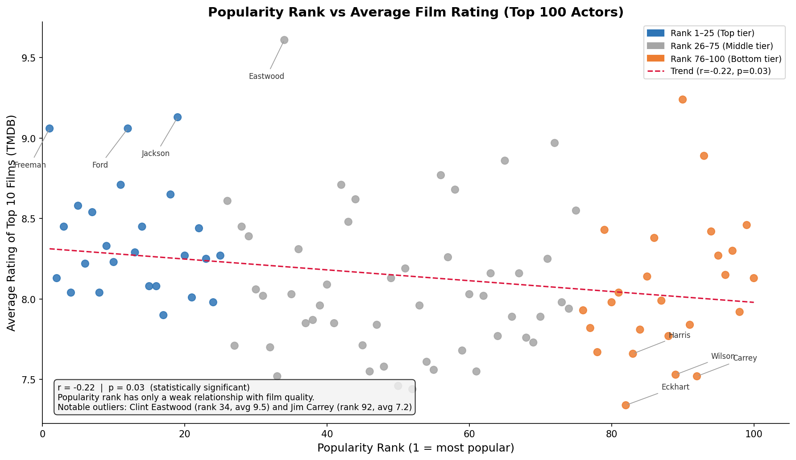
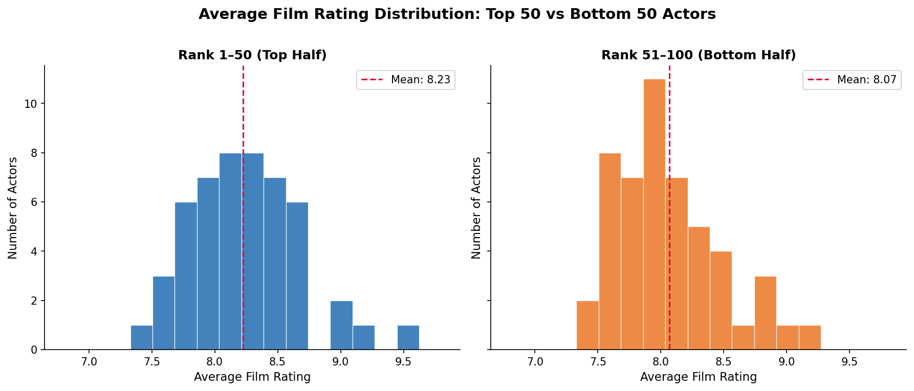
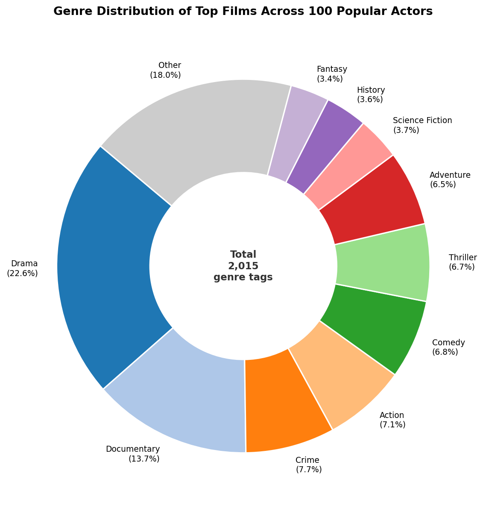
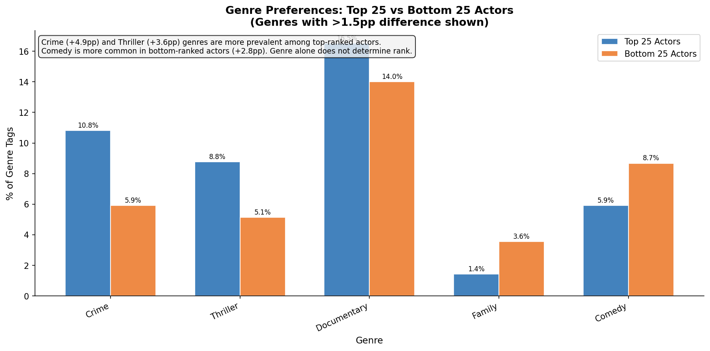

# 🎬 Factors Affecting Actor Popularity


An end-to-end data pipeline that scrapes IMDB's top 100 popular male actors, retrieves their top-rated films via the TMDB API, stores everything in a SQLite database, and runs statistical analysis to answer one central question:

> **Does film quality actually explain why an actor is popular — or is something else driving the rankings?**

---

## Table of Contents
- [Key Findings](#key-findings)
- [Data Sources](#data-sources)
- [Database Schema](#database-schema)
- [Analysis](#analysis)
- [Visualizations](#visualizations)
- [How to Run](#how-to-run)
- [Project Structure](#project-structure)
- [Limitations & Future Work](#limitations--future-work)

---

## Key Findings

**1. Film quality has a statistically significant but weak relationship with popularity rank.**
The Pearson correlation between popularity rank and average film rating is **r = -0.22** (p = 0.025). While this clears the significance threshold, the effect size is small — film quality explains only about **5% of the variance** in popularity rank (r² = 0.05). Popularity is clearly driven by much more than just how good your films are.

**2. The top 50 vs bottom 50 difference is real but tiny.**
Top-50 actors average a film rating of **8.23** vs **8.07** for the bottom 50 — a gap of just **0.16 rating points**. While directionally consistent with the correlation finding, this difference is not large enough to be practically meaningful.

**3. Some of the most popular actors have surprisingly average film ratings — and vice versa.**
- **Clint Eastwood** (rank #34) has the highest average film rating in the dataset at **9.5** — yet ranks far lower than Morgan Freeman or Leonardo DiCaprio.
- **Jim Carrey** (rank #92) and **Tom Cruise** (rank #27) both average just **7.2** — among the lowest in the dataset. Their cultural impact and box-office dominance explain their popularity far more than critical reception does.

**4. Crime and Thriller are the genres most associated with top-ranked actors.**
Top-25 actors have Crime (10.8%) and Thriller (8.8%) films at notably higher rates than bottom-25 actors (5.9% and 5.1%). Comedy skews toward lower-ranked actors (8.7% vs 5.9%).

**5. Drama is universal — not a differentiator.**
Drama appears at nearly identical rates for top-25 (21.0%) and bottom-25 (21.3%) actors. Being in drama films alone says nothing about where an actor ranks.

---

## Data Sources

| Source | What it provides |
|--------|-----------------|
| [IMDB Popular Actors List](https://www.imdb.com/list/ls022928819/) | Popularity rank and name for top 100 male actors |
| [TMDB API v3](https://developers.themoviedb.org/3/) | Actor IDs, top-rated film data, genre metadata |

The pipeline is built around IMDB's "most popular male actors of the 2010s" list. For each actor, the top 10 highest-rated films from TMDB are retrieved, resulting in a database of **100 actors** and **703 unique films**.

---

## Database Schema

```
Actors_Popularity        Actors                     Films
──────────────────       ──────────────────────     ─────────────────────
popularity_rank (PK)     actor_id (PK)              film_id (PK)
actor_name               actor_name                 name
                         actor_films (CSV of IDs)   genres (CSV of IDs)
                         film_avg                   rating

                         Genres
                         ──────────────────
                         genre_id (PK)
                         genre_name
```

> **Note on schema design:** `actor_films` and `genres` store comma-separated IDs — a pragmatic choice for a single-developer pipeline. A production schema would use junction tables to enable proper relational queries.

---

## Analysis

### Correlation: Rank vs Film Quality

The scatterplot below shows the relationship between an actor's popularity rank (x-axis) and the average TMDB rating of their top 10 films (y-axis). Actors are color-coded by tier.



The trend line slopes slightly downward — better rank correlates with slightly higher average film ratings. The correlation is **statistically significant** (r = -0.22, p = 0.025), but the **effect size is small**: rank explains only ~5% of the variance in film quality. The wide vertical spread at every rank level makes clear that film quality is not a reliable predictor of popularity on its own.

**Notable outliers:**
- **Clint Eastwood** (rank 34, avg 9.5) — his decades-long career of critically acclaimed work gives him an exceptional film average, yet his rank is mid-table.
- **Robin Williams** (rank 90, avg 9.1) — legacy films inflate his average while his rank reflects a later-career period.
- **Jim Carrey** (rank 92, avg 7.2) and **Tom Cruise** (rank 27, avg 7.2) — both highly popular despite average critical reception, suggesting commercial appeal and cultural presence outweigh critical scores.

---

### Top 50 vs Bottom 50

| Group | Mean Rating | Std Dev | Min | Max |
|-------|------------|---------|-----|-----|
| Rank 1–50 | **8.226** | 0.408 | 7.2 | 9.5 |
| Rank 51–100 | **8.066** | 0.592 | 7.0 | 9.1 |
| **Difference** | **+0.160** | — | — | — |

Welch two-sample t-test: **t = 1.60, p = 0.113** → difference between groups is not statistically significant on its own, though the overall rank-rating correlation is.



The distributions largely overlap. The top 50 are slightly more concentrated in the 7.5–8.5 range, while the bottom 50 show more spread — but both groups contain actors with very high and very average film ratings.

---

### Decile Breakdown

Breaking the 100 actors into 10 groups of 10 by rank reveals the trend is **non-monotonic** — film quality does not consistently decrease as rank drops:

| Rank Group | Mean Rating | Notes |
|-----------|-------------|-------|
| 1–10 | 7.98 | Morgan Freeman (8.8), Tom Hanks (8.0) |
| 11–20 | **8.14** | Highest of any decile — Samuel L. Jackson (8.9), Kevin Spacey (8.6) |
| 21–30 | 7.84 | Tom Cruise (7.2) pulls this group down |
| 31–40 | 7.69 | Clint Eastwood (9.5) is the outlier here |
| 41–50 | 7.70 | — |
| 51–60 | 7.71 | — |
| 61–70 | 7.61 | — |
| 71–80 | 7.74 | — |
| 81–90 | 7.61 | Robin Williams (9.1) offsets several lower-rated actors |
| 91–100 | **7.87** | Surprisingly high — John Travolta (8.7), Ewan McGregor |

The **11–20 decile outperforms the top 10** in average film quality, and the **91–100 group outperforms several middle tiers**. This non-linearity confirms that rank is not a simple function of film quality.

---

### Rank vs Quality Mismatches

**Actors whose film quality exceeds their rank** (ranked lower than their films deserve):

| Actor | Rank | Film Avg | Gap Score |
|-------|------|----------|-----------|
| Clint Eastwood | 34 | 9.50 | −3.96 |
| Morgan Freeman | 1 | 8.80 | −3.72 |
| Harrison Ford | 12 | 8.80 | −3.34 |
| Samuel L. Jackson | 19 | 8.90 | −3.29 |
| Kevin Spacey | 18 | 8.60 | −2.73 |

**Actors whose rank exceeds their film quality** (more popular than their films suggest):

| Actor | Rank | Film Avg | Gap Score |
|-------|------|----------|-----------|
| Aaron Eckhart | 82 | 7.00 | +2.65 |
| Jim Carrey | 92 | 7.20 | +2.60 |
| Owen Wilson | 89 | 7.20 | +2.50 |
| Ken Watanabe | 88 | 7.20 | +2.46 |
| Richard Harris | 83 | 7.20 | +2.29 |

> Gap score = z(rank) − z(film_avg). Negative = film quality exceeds rank expectation. Positive = rank exceeds film quality expectation.

---

### Genre Analysis



Drama dominates at **23.4%** of all genre tags across 703 films. Documentary is second at **14.7%** — notably high, reflecting that many acclaimed actors appear in or are subjects of documentary projects.

**Genre preferences differ meaningfully by rank tier:**



| Genre | Top 25 | Bottom 25 | Difference |
|-------|--------|-----------|------------|
| Crime | 10.8% | 5.9% | **+4.9pp** |
| Thriller | 8.8% | 5.1% | **+3.6pp** |
| Comedy | 5.9% | 8.7% | **−2.8pp** |
| Documentary | 16.5% | 14.0% | +2.5pp |
| Drama | 21.0% | 21.3% | −0.3pp (essentially equal) |

Top-ranked actors gravitate toward Crime and Thriller — genres associated with prestige, critical acclaim, and cultural staying power. Comedy-heavy filmographies correlate with lower IMDB popularity rankings, possibly because comedy success translates less to critical prestige than dramatic or thriller work. Drama is the great equalizer — equally prevalent across all rank tiers.

---

## How to Run

### Setup

```bash
git clone https://github.com/goel-mehul/Factors-Affecting-Actor-Popularity.git
cd Factors-Affecting-Actor-Popularity
pip install -r requirements.txt
export TMDB_API_KEY=your_key_here   # get one free at themoviedb.org
```

> **Note:** A pre-populated `Popular_Actors.db` is included so you can skip Steps 1–2 and go straight to the analysis scripts.

### Step 1 — Build actor database (run 4 times)
```bash
python part1.py
```
Adds 25 rows per run to `Actors` and `Actors_Popularity` tables.

### Step 2 — Populate films (run 4 times)
```bash
python populate_films.py
```
Fetches top 10 films per actor from TMDB. 25 actors processed per run.

### Step 3 — Run analysis & generate visuals
```bash
python calculate.py          # Populates film_avg, runs stats, saves histogram
python visualization1.py     # Scatterplot with regression line and annotations
python visualization2.py     # Genre donut chart + tier comparison chart
```

Results saved to:
- `Calculations/calculation_results.txt` — full JSON stats output
- `Calculations/piechart_results.txt` — genre distribution JSON
- `Visualizations/` — all chart PNGs

---

## Project Structure

```
Factors-Affecting-Actor-Popularity/
├── Popular_Actors.db              # Pre-populated SQLite database
├── part1.py                       # Step 1: scrape IMDB + build actor tables
├── populate_films.py              # Step 2: fetch top films from TMDB
├── calculate.py                   # Step 3a: statistical analysis + histogram
├── visualization1.py              # Step 3b: scatterplot
├── visualization2.py              # Step 3c: genre charts
├── requirements.txt
├── Calculations/
│   ├── calculation_results.txt    # Full stats output (JSON)
│   └── piechart_results.txt       # Genre distribution output (JSON)
└── Visualizations/
    ├── scatterplot.PNG
    ├── histogram.png
    ├── piechart.PNG
    └── genre_comparison.png
```

---

## Limitations & Future Work

- **Sample bias:** The IMDB list reflects popularity among IMDB users — a demographic skewed toward Western, English-language cinema. This likely inflates rankings for Hollywood actors.
- **Film selection method:** TMDB's sort-by-vote-average can surface obscure low-vote films with inflated ratings. Filtering by `vote_count > 500` would produce more statistically reliable ratings.
- **Schema:** Storing film IDs and genre IDs as comma-separated strings makes joins awkward. A proper junction table design would enable richer queries.
- **Other popularity factors not measured:** Social media following, award nominations, box office gross, and public presence are all likely stronger predictors of IMDB popularity rank than film rating alone.
- **Future work:** Scrape additional signals (award nominations, box office data, social media) and build a regression model to quantify each factor's contribution to popularity rank.
